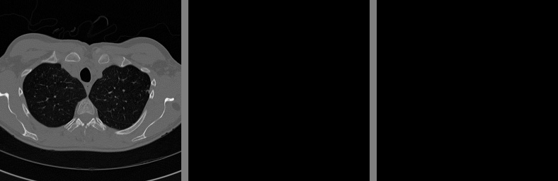
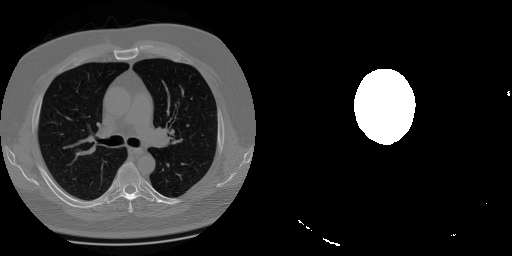

# CT-Heart-Segmentation

## **Overview**  
This project focuses on **automated heart segmentation** from **CT scans** using deep learning. We applied **data augmentation** techniques using the **Albumentations library** to enhance model generalization and trained a **U-Net model** to segment heart structures accurately.  

Medical image segmentation is crucial in **cardiovascular disease diagnosis**, treatment planning, and surgical interventions. This project aims to provide a robust and efficient deep learning pipeline for **heart segmentation from CT images**.  

---

## **Dataset** 
The dataset consists of **CT scan images** with corresponding segmentation masks representing heart structures. The images undergo preprocessing and augmentation before being fed into the segmentation model.  

### **Kaggle link for Dataset:** https://www.kaggle.com/datasets/nikhilroxtomar/ct-heart-segmentation

### **Preprocessing Steps:**
✅ Resizing images to a fixed resolution  
✅ Normalizing pixel values for stable training  

---

## **Data Augmentation using Albumentations**  
To improve the model's generalization and performance, we applied **data augmentation** using the **Albumentations** library. This helps to create diverse training samples, reducing overfitting and improving robustness.  

### **Augmentations Applied:**
✅ **RandomBrightnessContrast** → Adjusts brightness and contrast randomly to simulate variations in scanning conditions  
✅ **HueSaturationValue** → Modifies the hue, saturation, and value of the image to introduce color variations  
✅ **RGBShift** → Shifts the red, green, and blue channels to create different color variations  
✅ **RandomGamma** → Randomly adjusts gamma levels to enhance or darken image regions  
✅ **CLAHE (Contrast Limited Adaptive Histogram Equalization)** → Enhances local contrast to improve visibility of structures  
✅ **ChannelShuffle** → Randomly shuffles color channels to increase diversity in training samples  

---

## **Model Architecture: U-Net for Segmentation**  
We implemented a U-Net model, a well-known CNN-based architecture for biomedical image segmentation. U-Net is effective in capturing both local and global spatial information using its encoder-decoder structure with skip connections.  

### **U-Net Architecture Highlights:**
🔹 **Encoder** (Contracting Path) → Captures spatial features using convolutional layers  
🔹 **Bottleneck** → Connects the encoder and decoder with high-level feature maps  
🔹 **Decoder** (Expanding Path) → Recovers spatial resolution for precise segmentation  
🔹 **Skip Connections** → Retains fine-grained details by merging encoder features  

---

## **Training Process **  
The model was trained using TensorFlow/Keras with the following setup:  
✅ Loss Function → Binary Cross-Entropy + Dice Loss  
✅ Optimizer → Adam optimizer for efficient learning  
✅ Learning Rate Scheduling → Reduces learning rate on plateaus  
✅ Evaluation Metrics → Dice Coefficient, IoU, Accuracy  

### Examples of CT Segmentation
Below are results of Unet segmentation:

the image from validation set is structred as [Image - True mask - Predicted mask] 

the image from test set is structred as [Image - Predicted mask] 

